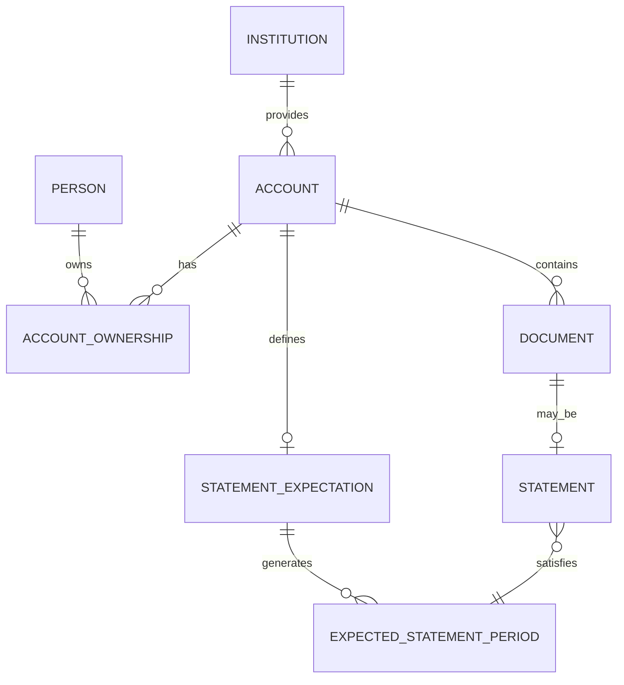

# Domain

## Purpose

Passbook models household financial accounts and the records that belong to them.

The core domain question is:

> What financial relationships exist, and are their expected records complete?

The domain should be organized around accounts and their lifecycle, not around folders or file paths.

## Core concepts

### Person

Represents a household member who can own one or more accounts.

An account may have one owner or multiple owners.

Examples:

```text
Person A
Person B
```

Ownership should be structured data. It should not be encoded into account names.

---

### Institution

Represents an organization that provides or manages a financial relationship.

Examples:

```text
Bank
Credit union
Investment provider
Mortgage lender
Credit provider
Financing provider
```

An institution may have lightweight metadata such as:

```text
Name
Logo
Website
Notes
```

Passbook is not intended to become an institution directory.

---

### Account

The Account is the main aggregate in Passbook.

It represents an ongoing or historical financial relationship.

Examples include:

```text
Chequing account
Savings account
Credit card
Line of credit
TFSA
RRSP
FHSA
Investment account
Mortgage
Loan
Financing account
```

An account may contain:

```text
Institution
Display name
Account type
Identifier suffix
Opened date
Closed date
Status
Notes
Owners
Statement expectation
Documents
```

The identifier suffix should normally be something limited, such as the last four digits, rather than a full sensitive account number.

Two accounts may share the same product name, so display name alone should not be treated as identity.

---

### Account ownership

Ownership connects people to accounts.

Conceptually:

```text
Person
  ↓
AccountOwnership
  ↓
Account
```

This supports:

```text
Person A → Account A
Person B → Account B
Person A + Person B → Joint Account
```

The initial model does not need complicated ownership roles unless a real use case requires them.

---

### Account lifecycle

An account can be active or closed.

Initial states:

```text
Active
Closed
```

Lifecycle information may include:

```text
Opened date
Closed date
Status
```

Closing an account must:

- preserve its documents;
- preserve historical statement periods;
- stop future statement expectations;
- keep the account accessible in history.

Closing an account must never behave like deleting it.

---

### Statement expectation

A StatementExpectation defines how often an account is expected to produce statements.

Initial frequencies:

```text
Monthly
Quarterly
Annually
Irregular
None
```

Possible fields include:

```text
Frequency
Start date
End date
Availability delay
```

The expectation works together with the account lifecycle.

Example:

```text
Opened:
June 2025

Frequency:
Monthly

Closed:
February 2026
```

Passbook should only expect statement periods within the relevant account lifetime.

---

### Expected statement period

Represents a period for which Passbook believes a statement should exist.

Examples:

```text
January 2026
Q2 2026
2026
```

These periods should normally be derived from the statement expectation rather than manually created by the user.

A period may conceptually be:

```text
Complete
Waiting
Missing
Future
```

These states can be computed instead of stored if that keeps the model simpler.

---

### Document

A Document represents a file associated with an account.

Possible fields:

```text
Account
Document type
Document date
File
Notes
```

Initial document types may include:

```text
Statement
Notice
Agreement
Opening document
Closure document
Financial correspondence
Other
```

A document should inherit context from its account instead of duplicating it.

For example, institution and ownership do not need to be copied onto every document.

---

### Statement

A Statement is a document tied to a statement period.

Conceptually:

```text
Account
  ↓
Statement
  ↓
Expected Statement Period
```

Example:

```text
Account:
Momentum Visa

Period:
August 2026

File:
statement.pdf
```

A statement normally satisfies one expected statement period.

Duplicate handling can be treated separately from the core domain.

## Completeness

Statement completeness is a derived view.

It depends on:

```text
Account lifecycle
+
Statement expectation
+
Current date
+
Expected periods
+
Uploaded statements
```

Example:

```text
January      Complete
February     Complete
March        Missing
April        Complete
May          Complete
June         Complete
July         Missing
August       Complete
September    Waiting
October      Future
```

Passbook should distinguish between:

- a statement that is genuinely missing;
- a statement that is not expected to be available yet;
- a future period.

The exact availability-delay rules can be refined during implementation.

## Domain relationships



## Read models

The write model should remain small.

The UI can expose derived views without turning each one into a persisted domain object.

### Account overview

```text
Momentum Visa

Owners
Person A

Status
Active

2026 Statements
10 / 12

Missing
March
July
```

### Institution overview

```text
Example Bank

Chequing
Complete

Momentum Visa
2 missing

Line of Credit
Complete
```

### Household completeness

```text
2026

Expected statements: 42
Stored: 40
Missing: 2
```

### Missing records

```text
Needs attention

Momentum Visa
March 2026

Investment Account
Q2 2026
```

## Domain boundaries

Passbook should not become the software equivalent of a generic `Finance` folder.

A record belongs to the domain that gives it meaning.

### Property

The property or home domain owns:

```text
Property
Ownership
Maintenance
Repairs
Renovations
Appliances
Household items
Property documents
```

Passbook may own:

```text
Mortgage account
Mortgage statements
Mortgage lender relationship
```

The property app may reference the corresponding Passbook account.

---

### Vehicles

Garage owns:

```text
Vehicle
Vehicle insurance policy
Registration
Maintenance
Repairs
Vehicle documents
```

Passbook may own:

```text
Vehicle loan
Vehicle financing account
Account-level insurer statements
```

---

### Employment

The employment domain owns:

```text
Employer
Employment period
Employment contract
Contract amendments
Compensation history
Payslips
Professional licences
Professional insurance
```

Taxbook may consume tax-relevant data from that domain.

Passbook should not own payslips simply because they contain financial information.

---

### Tax

Taxbook owns tax-year and filing records.

Examples:

```text
T4
Tax slips
Deduction records
Filed returns
Notices of assessment
Tax-year calculations
```

Taxbook may reference information from Passbook or other domains where useful.

---

### Healthcare

First Aid owns:

```text
Appointments
Healthcare expenses
Claims
Medical receipts
Health records
Benefits
Providers
```

Passbook does not own medical receipts.

---

### Household items

A property or inventory domain may own:

```text
Item
Purchase
Receipt
Warranty
Maintenance
Serial number
Lifecycle
```

Examples:

```text
TV
Standing desk
Appliance
Furniture
Electronics
```

The receipt belongs to the item because the item is why the receipt remains useful.

---

### Budgeting

A future budgeting application may own:

```text
Transactions
Categories
Budgets
Cash-flow planning
Transaction imports
Transaction receipts
```

Passbook and budgeting may reference the same real-world account, but they remain separate bounded contexts.

Passbook asks:

> What financial relationship exists, and are its records complete?

Budgeting asks:

> What money moved, and how should it be planned or categorized?

## Cross-domain references

Prefer references over duplicated ownership.

For example:

```text
Home
  ↓
Mortgage account reference
  ↓
Passbook
```

The home app should not copy the mortgage statements just because the mortgage is related to the property.

Likewise, another app may reference Passbook account identity when needed without taking ownership of Passbook's records.

Do not design a universal cross-app entity graph before a real integration requires it.

## Important rules

### Account is the primary aggregate

Do not introduce broader abstractions unless real data demonstrates the need.

### Documents belong to accounts

Passbook is not a generic document management system.

### Statement periods are derived

The user configures the schedule. The system determines which periods should exist.

### Ownership is structured

Do not infer ownership from filenames, folders, or account names.

### Closed accounts preserve history

Account closure must never delete historical records.

### Domain ownership beats financial categorization

Something involving money does not automatically belong in Passbook.

Ask:

> What relationship or object makes this record useful?

That domain should usually own it.

### Storage is implementation

Filesystem layout, filenames, and physical storage paths are implementation concerns.

The user-facing domain should remain centered on institutions, accounts, periods, and records.
