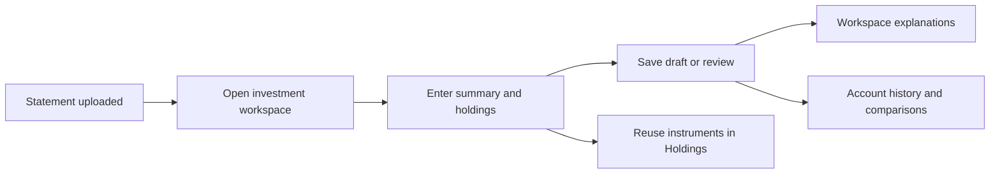
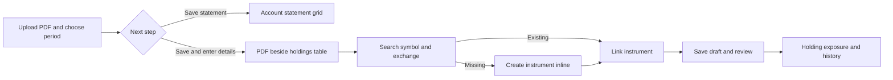
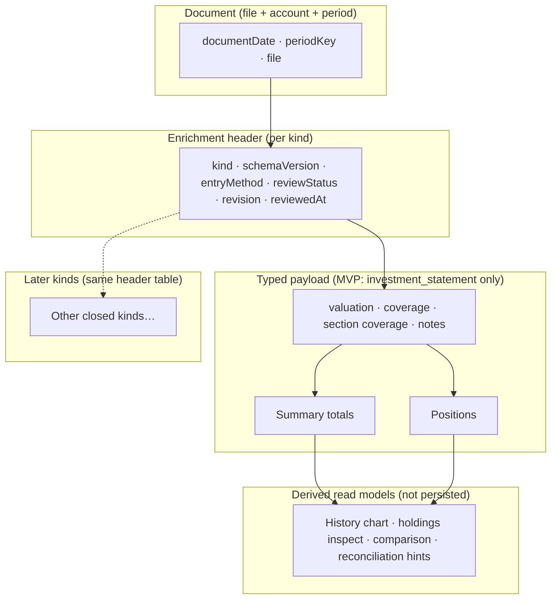
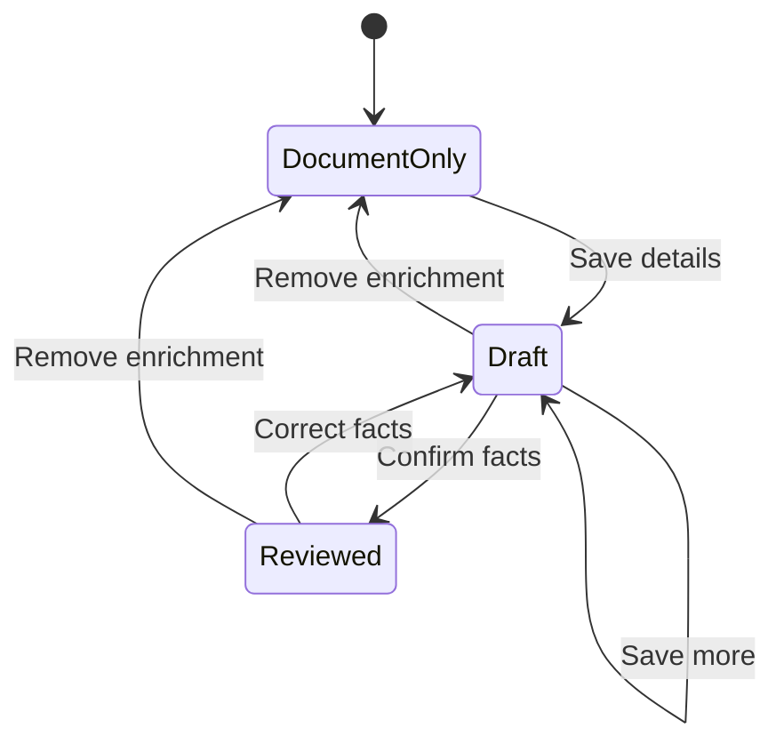
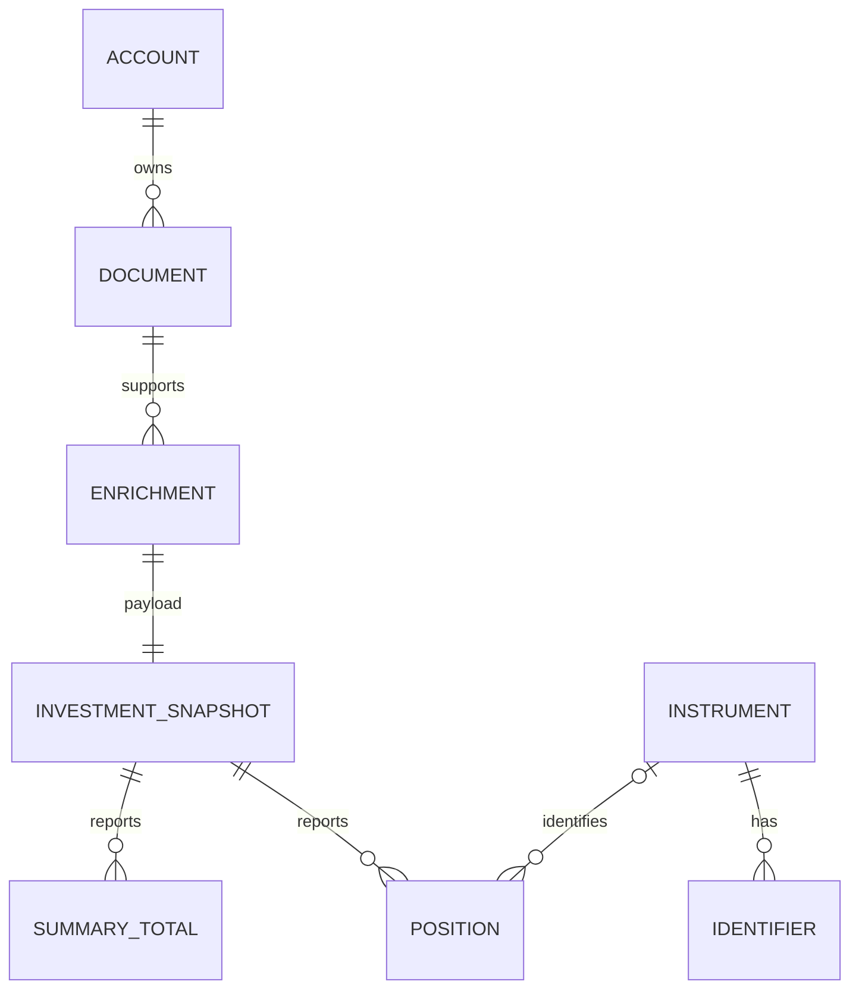

# Investment statement understanding

Passbook provides an optional workflow for **investment, TFSA, RRSP, and FHSA**
statements: keep today's fast upload, then enter statement-reported values and
holdings beside the PDF, review them, and read deterministic explanations and
comparisons. Amounts trace back to saved facts on a specific statement—not to
live market data, inferred returns, or AI.

Authoritative product boundaries live in [PRODUCT.md](./PRODUCT.md) and
[DOMAIN.md](./DOMAIN.md). Phased delivery is summarized in
[ROADMAP.md](./ROADMAP.md). Broader wealth-planning ideas remain exploratory in
[FINANCIAL_DIRECTION.md](./FINANCIAL_DIRECTION.md) and are **not** part of this
scope.

## What stays the same

- Uploading a PDF and satisfying the period grid still means the **file is
  present**. Legacy imports need no rework.
- Enrichment is **optional** post-upload work with a complete manual path.
- One statement document still maps to **one account and one period**; combined
  statements that cover multiple accounts are out of scope until the
  source-document model changes.
- Monthly, quarterly, and annual schedules share the **same investment payload
  schema**; frequency only affects which period cell a document satisfies.

## User flow

The shipped slice includes reported opening/closing values, optional
period-summary fields, stock/ETF/mutual-fund positions, cash, a global
**Holdings** catalog with symbol/exchange search, compact table entry, and
same-account comparisons driven only from saved facts. Statement activity rows
(buys/sells), AI draft entry, live portfolio valuation and household net worth
remain out of scope. Holding pages compare statement-observed exposure across
accounts, separately for each native currency.

## Entry and holding detail views

Upload an eligible investment statement and choose **Save and enter details** to
open the statement workspace. **Save statement** keeps the upload-only path.
The workspace keeps the local PDF visible with page and zoom controls. The
valuation date remains visible above the entry area; holdings, summary, dates /
notes and checks have separate sections. Holdings use a table with the usual
numeric fields in each row and source references in **Details**.

**Link instrument** searches names, symbols, exchanges, fund codes and series.
Create a missing instrument in the same workflow. Tickers pair with an exchange
(the identifier namespace); fund codes pair with an issuer. ISIN and CUSIP are
also supported. The printed label remains separate from the reusable identity.
There is no market-data lookup or automatic symbol resolution.

A holding's **exposure** is a derived view. For each account, use one latest
reviewed statement on or before the selected date. Repeated lines in that
snapshot aggregate with decimal arithmetic. Shares use entered holdings and
cash in the same native currency, never an account total expressed in another
currency. Missing values block the relevant total and percentage; partial
coverage remains labelled. Absence in a complete holdings snapshot can show
zero observed exposure, without inventing a sale transaction. Source dates and
statements remain visible because accounts can have different valuation dates.
Multiple reviewed statements at the same latest date are labelled as ambiguous
and block exposure for that account rather than choosing a value arbitrarily.
Accounts without a reviewed statement on the selected date are excluded and
labelled; this does not claim complete household coverage.

The query batches full positions for those latest snapshots and the selected
holding's history. It does not send every historical portfolio position to the
client. Charts share the shadcn primitive in `packages/ui`; PDF rendering and
investment entry remain Passbook-specific. No new fact tables or generic field
engine are introduced for these views.

## Enrichment architecture

Each allowed **kind** gets at most one **document enrichment header** per
document. The header holds lifecycle metadata only; financial facts live in a
**typed payload** (one payload table per kind today). New document kinds can add
new payloads under the same header pattern without changing upload or period
logic.

| Concern                             | Where it lives                                       |
| ----------------------------------- | ---------------------------------------------------- |
| Issue date                          | Document (`documentDate`)                            |
| Expected period cell                | Document / schedule                                  |
| Actual coverage and valuation dates | Investment payload                                   |
| How facts were entered              | Enrichment header (`entryMethod`; MVP is `manual`)   |
| Review confirmed                    | Enrichment header (`reviewStatus`, `reviewedAt`)     |
| Section completeness                | Investment payload (`summary` / `holdings` coverage) |
| Edit concurrency                    | Enrichment header (`revision`)                       |

**Review is separate from section coverage.** A snapshot can be **reviewed** while
summary or holdings remain **partial**; unknown is not zero, and an omitted line
is not evidence that a holding was sold. The period grid shows **statement
uploaded** separately from **investment details** status (not entered / draft /
reviewed, with partial coverage called out).

`schemaVersion` on the header tracks the financial schema for that kind; it
changes when migrations evolve payload shape, not on every edit. `revision`
increments on each successful save or review. Saves are atomic across header,
payload, totals, and positions; stale revisions are rejected and edits clear
review.

## Data model (investment kind)

- **Instrument** — reusable catalog entry (stock, ETF, mutual fund, other),
  including fund series and confirmed identifiers (ticker, fund code, ISIN, CUSIP).
  Matching on ticker or name alone is not allowed.
- **Position** — what a given statement reports (investment, cash, or other),
  preserving source labels as printed; multiple rows per instrument are allowed.
- **Summary total** — reported figures per currency and scope (`account_total` or
  `currency_component`); converted totals and native components are never summed
  together.

Ownership path for facts: position or total → snapshot → enrichment header →
document → account. The payload does not duplicate account or period keys.

Monetary values use **explicit currency** on every amount. The app does not
silently convert currencies, infer investment **return** from change in account
value, or present book-cost difference as tax or performance.

### Provenance

Source references are stored **per summary-total row and per position row** as
optional `sourcePage` and `sourceNote`. There is no separate per-field provenance
metadata in the MVP schema; use row-level page and note when the statement cites
a location for that line or block.

## Deterministic understanding (no AI required)

Current read-side behavior includes:

- Inline definitions for reported market value, quantity, unit price, and book
  cost in the investment workspace (institution-reported, not tax-adjusted cost
  base). See `fieldDefinitions` in
  [`shared/components/investment-statements/investment-labels.ts`](../shared/components/investment-statements/investment-labels.ts).
- Account **investment statement history**: reported closing value over
  **valuation dates** (shared shadcn line chart), a list of enriched statements, and **holdings
  at the selected date** grouped by value currency (entered lines only when
  holdings coverage is partial).
- Two-statement **What changed?** comparison for the **same account** with
  explicit non-adjacent dates; observations only when data is complete enough
  (see `compareSnapshotHoldings` in
  [`shared/modules/investment-statements/domain/comparison.ts`](../shared/modules/investment-statements/domain/comparison.ts)).
- Summary reconciliation hints in the workspace when holdings coverage, summary
  coverage, and currency align; otherwise labeled not comparable or partial
  (see
  [`shared/modules/investment-statements/domain/reconciliation.ts`](../shared/modules/investment-statements/domain/reconciliation.ts)).

Change in reported account value is **not** investment return. Without
compatible period-flow facts, Passbook does not compute return percentages or
describe unexplained residuals as earnings.

## Developer reference: enrichment kinds

Enrichment **kind** is a closed, code-owned registry—not a runtime schema
builder. Each kind defines eligibility, payload schema, validation, review rules,
and read views. **MVP:** only `investment_statement` is writable. Future kinds
(for example LOC statement summaries or agreement-term extraction) reuse the
same header table with new payloads and use cases.

| Responsibility | Notes                                                         |
| -------------- | ------------------------------------------------------------- |
| Eligibility    | Allowed document types and account types                      |
| Payload schema | One typed table (or small set) per kind                       |
| Validation     | Host-side on save and review                                  |
| Provenance     | Row-level `sourcePage` / `sourceNote` on totals and positions |
| Review rules   | Required facts before `reviewed`                              |
| Read views     | Derived comparisons, charts, reconciliation                   |

Implementation modules:

- [`shared/modules/investment-statements/`](../shared/modules/investment-statements/) —
  snapshot lifecycle, save/review/remove, comparisons and reconciliation
  (exact decimal arithmetic in `domain/`).
- [`shared/modules/investments/`](../shared/modules/investments/) — instrument
  catalog and global Holdings query.
- [`shared/components/investment-statements/`](../shared/components/investment-statements/) —
  workspace, account history, Holdings page, and badges.

### Types and persistence

- DTOs and command shapes:
  [`shared/modules/investment-statements/domain/snapshot-dto.ts`](../shared/modules/investment-statements/domain/snapshot-dto.ts)
- Instrument DTOs:
  [`shared/modules/investments/domain/instrument-dto.ts`](../shared/modules/investments/domain/instrument-dto.ts)
- Tables and enums (`document_enrichments`, snapshots, totals, positions,
  instruments):
  [`shared/server/db/schema.ts`](../shared/server/db/schema.ts)

### Transport (tRPC)

Routers adapt domain services only; shapes match the DTOs above.

| Namespace               | Procedures                                                   | Router                                                                                |
| ----------------------- | ------------------------------------------------------------ | ------------------------------------------------------------------------------------- |
| `investmentStatements`  | `getByDocument`, `listByAccount`, `save`, `review`, `remove` | [`investment-statements.ts`](../shared/server/api/routers/investment-statements.ts)   |
| `investmentInstruments` | `list`, `create`, `update`, `holdings`                       | [`investment-instruments.ts`](../shared/server/api/routers/investment-instruments.ts) |

Client routes:

- `/statements/:documentId/investments` — entry workspace beside the PDF
- `/holdings` — global instrument catalog and source-linked observations

Entry points also include the statement period grid, statement detail sheet, and
account investment history panel for eligible accounts.

Frontend presentation must not implement financial arithmetic with `Number`;
chart coordinates may round for display only.

## Explicit exclusions

- Live prices, FX feeds, bank sync, transaction ledger, tax filing, AI advice.
- Household net worth, live combined portfolio valuation or totals converted across currencies.
- Reconstructing holdings from activity rows (a later slice).
- Generic user-defined fields or a universal facts engine.

## Verification

`pnpm check:passbook`, domain tests under `shared/modules/investment-statements/`,
and investment entry E2E cover this slice. Migrations do not backfill guessed
investment facts; existing uploads remain **not entered** until enriched.
