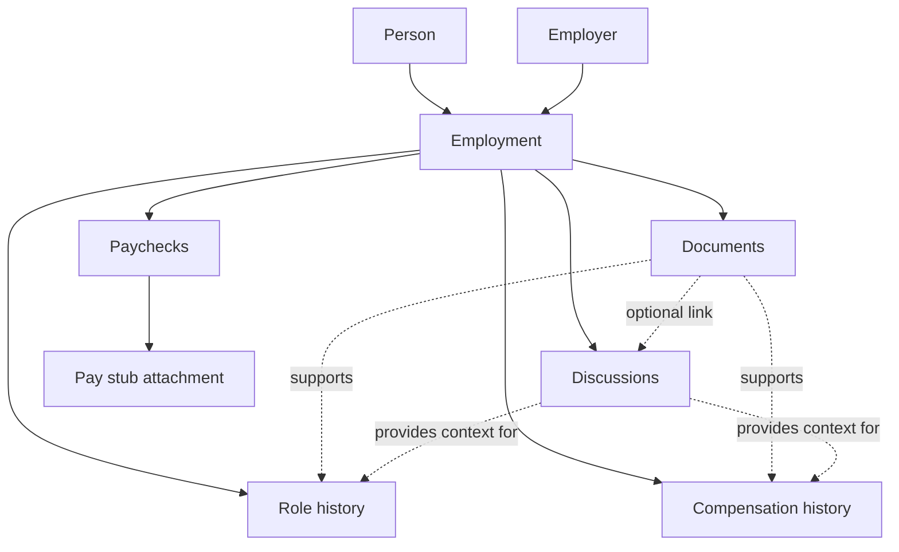

# Tenure — Domain

Tenure preserves a person's history with each employer: what they agreed to, what they were paid, and the records of important employment discussions. The employer relationship is the main way to navigate the information; this is not an HR system for managing other people.

## Domain map

**Employer** is the organization. **Employment** is a person's relationship with that organization over a period of time. Keeping them distinct allows a person to leave and later rejoin the same employer without merging separate periods of employment.

## Core concepts

| Concept             | Meaning                                                                                                                                                                         |
| ------------------- | ------------------------------------------------------------------------------------------------------------------------------------------------------------------------------- |
| Person              | The individual whose employment records are being kept. Supports separate records for household members.                                                                        |
| Employer            | An organization a person works or has worked for.                                                                                                                               |
| Employment          | A dated relationship between a person and employer, with current/former status and optional end date.                                                                           |
| Role history        | Positions or titles held during an employment, with effective dates. A simple current title is sufficient initially.                                                            |
| Compensation change | An agreed salary, hourly rate, or other compensation arrangement effective from a date. May include a reason and supporting document.                                           |
| Paycheck            | A particular payment for a pay period (start and end dates), with itemized earnings, deductions, and derived net pay. More than one paycheck may exist for the same pay period. |
| Pay period          | The date range a paycheck covers, distinct from the pay date when funds are issued. Used for completeness tracking and grouping paychecks.                                      |
| Pay stub            | The original file supporting a paycheck; its presence can be tracked independently from the entered amounts.                                                                    |
| Document            | A retained contract, offer, employment letter, or other official record associated with an employment.                                                                          |
| Discussion          | An important conversation, meeting, or email thread retained with its date, participants, and notes. May exist without an attached file.                                        |
| Note                | A manually written explanation or observation related to an employment or its records.                                                                                          |

## Paychecks and compensation are different

A **compensation change** records the agreed rate and when it took effect. It is not calculated from a pay stub. A **paycheck** records what was actually paid, including gross earnings, income tax, CPP, EI, and other line items. **Net pay is derived** from those line items, not entered independently; if the calculated net does not match the pay stub, a line item was entered incorrectly. A bonus, overtime, partial period, or deduction can change a paycheck without changing the agreed rate.

Paycheck line items use a **fixed catalog** of earnings and deduction types. Each employment configures which catalog lines appear and in what order, since employer pay-stub formats differ. Amounts and the original file should remain traceable to that paycheck.

## Relationships and rules

- One person may have many employments; one employer may be linked to many people or separate periods of employment.
- Each paycheck, compensation change, document, discussion, and note belongs to an employment. A document may optionally link to a discussion and may additionally support a particular change or role in later phases.
- Compensation entries have effective dates; the percentage change is derived from the previous comparable rate, not stored as an independent fact. Do not compare annual salary and hourly rate without an explicit conversion basis.
- Pay date and pay-period dates are distinct. Each paycheck records the pay period it covers (start and end). A paycheck can be entered before its original pay stub has been saved.
- More than one paycheck may belong to the same pay period. Completeness treats a period as covered when at least one paycheck exists for it; each paycheck still tracks its own pay-stub attachment independently.
- Pay frequency is recorded on the employment (including biweekly) and used to derive expected pay periods for completeness tracking.
- Retained email exports are stored as documents; discussions capture the surrounding context in notes. Notes add context without altering the original evidence.
- Ending an employment does not remove its records. Corrections to entered figures should not silently replace the original attached pay stub.

## Useful derived views

- **Employer overview:** current/former relationship, role, compensation, and recent records.
- **Compensation timeline:** effective rates and comparable dollar/percentage changes.
- **Pay history:** paychecks and their earnings/deductions, organized within an employment.
- **Pay-stub completeness:** expected pay periods derived from employment pay frequency (including biweekly); expected periods with no recorded paycheck; periods with paychecks where any lack a pay stub; periods marked not applicable when no pay was issued. Reviewable per employment and across employments.
- **Employment-record completeness:** expected but missing non-pay-stub documents such as offer letters, employment agreements, and contracts (later phase).

## Boundaries with other Your Tools apps

**Tenure owns** employment relationships, compensation history, paycheck detail, employment documents, and meaningful employment discussions. **Taxbook consumes** relevant paycheck totals for tax tracking; it should not become a second independent owner of the same paychecks. Passbook owns financial institutions and account statements, not employment pay stubs. Other domain apps retain their own documents rather than using Tenure as a general file cabinet.

### Taxbook integration

Tenure is the source of truth for paycheck line items and pay periods. Taxbook can:

- import historical paycheques from a Taxbook CSV export into a single Tenure employment
- read paycheck data from Tenure's local integration API for ongoing sync

Imported or synced paychecks may exist without pay stub PDFs; Tenure's existing pay-stub completeness views surface those gaps for follow-up.

## Not modeled yet

Commission reconciliation, detailed benefits administration, professional licensing, automatic payroll-portal downloads, and email synchronization need separate design before being added. In particular, a commission arrangement is not necessarily equivalent to a fixed salary or hourly rate.
