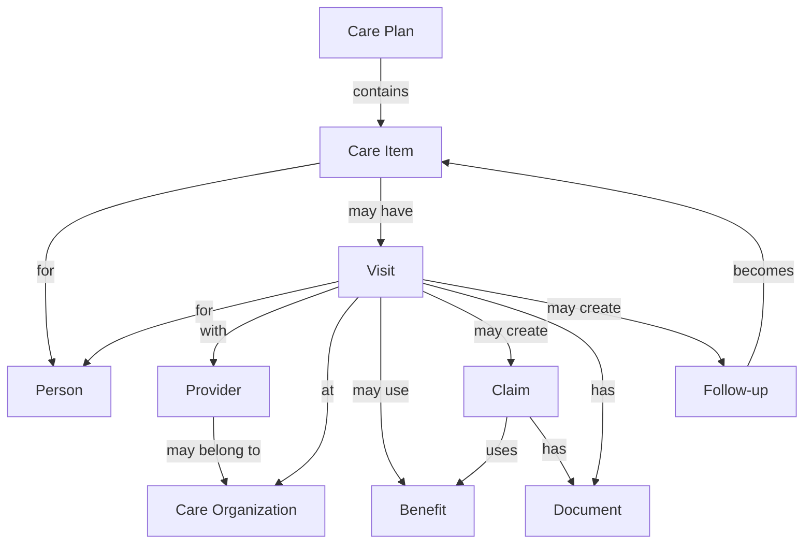
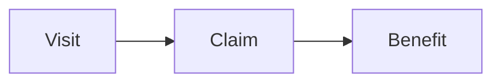
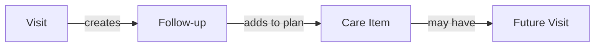
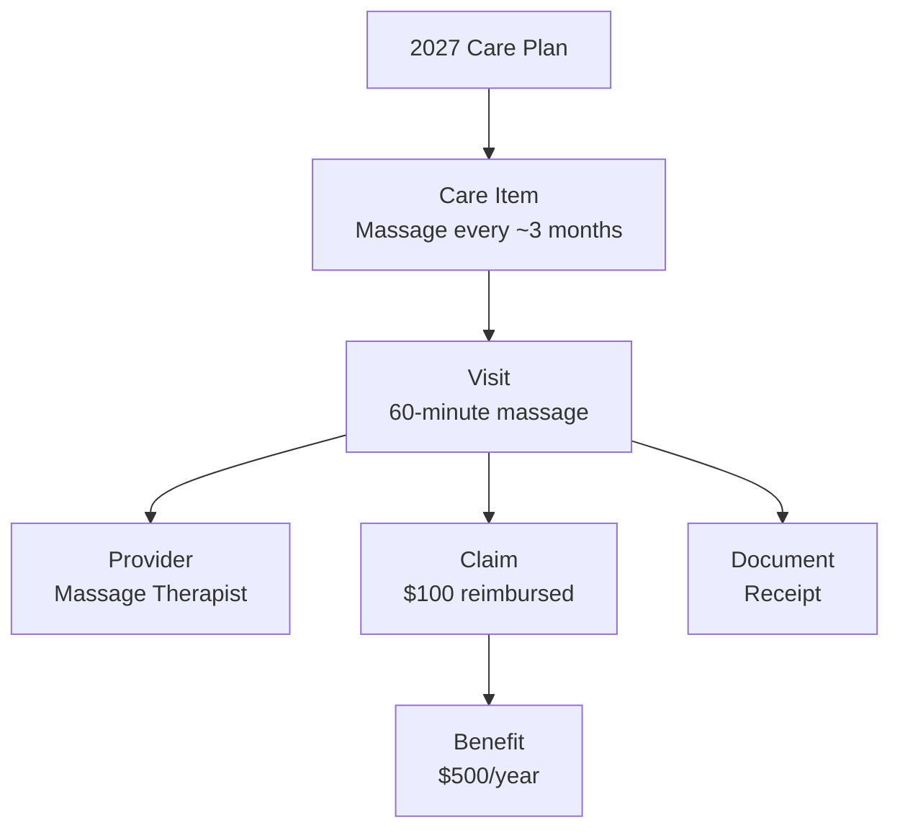
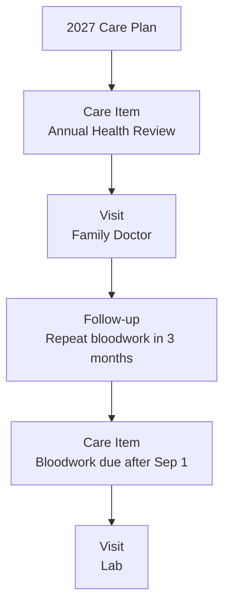
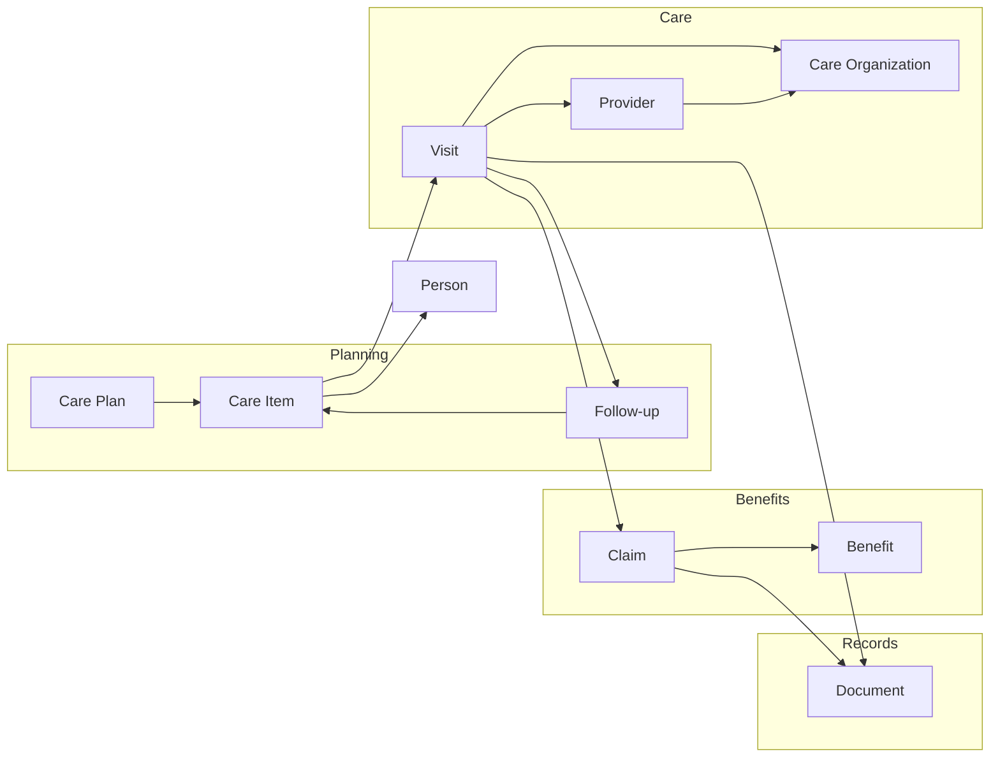

# First Aid — V1 Domain

First Aid helps manage a household's healthcare year.

The goal is not to build a complete medical-record system. The goal is to answer a few practical questions:

* What healthcare should we consider doing this year?
* What have we already planned or scheduled?
* What follow-ups are due?
* What healthcare benefits do we have available?
* What happened during previous visits?
* Where are the documents related to those visits?

The domain should stay focused on those problems.

## Domain Overview



The important lifecycle is:

```text
Care Plan
    ↓
Care Item
    ↓
Visit
    ↓
History / Documents / Claim
    ↓
Follow-up
    ↓
Future Care Item
```

This creates a loop rather than treating healthcare as a collection of unrelated appointments.

---

# Person

A person represents someone whose healthcare is being managed.

For V1 this will primarily be members of the household.

Examples:

* Me
* Spouse

A Person owns:

* care items
* visits
* benefit eligibility/usage

The Person domain should contain only basic information needed by First Aid. It should not attempt to become a complete patient profile.

---

# Care Plan

A Care Plan represents the household's healthcare plan for a period of time,
usually a calendar year. V1 has at most one household plan for each year.

Example:

```text
2027 Medical Year
```

A care plan is not created once and forgotten.

It can be reviewed and changed throughout the year.

For example:

```text
January
Plan the year.

June
Review overdue care and upcoming follow-ups.

September
Review vaccinations and remaining insurance benefits.

December
Review anything useful that is still outstanding.
```

A Care Plan contains Care Items. Each Care Item is assigned to one household
member, allowing the shared yearly view to be grouped by person.

---

# Care Item

A Care Item represents something that should be considered, planned, or completed.

Examples:

```text
Annual health review

Dental cleaning

Eye exam

Flu vaccination

Repeat bloodwork after March 1

Massage therapy

Physiotherapy

Tetanus booster
```

A Care Item does not mean that an appointment has already been booked.

It represents the intention or recommendation first.

Possible sources include:

```text
Preventive care
Provider recommendation
Personal routine
Insurance benefit
Follow-up from another visit
```

Possible timing models include:

```text
One-time
Yearly
Recurring interval
Seasonal
As needed
```

Each Care Item has a target number of visits. The target defaults to one, but a
goal such as massage therapy may target several visits during the year.

Its state is mostly inferred from linked Visits:

```text
Planned
In Progress
Completed
Not Pursuing
```

Planned means no scheduled or completed Visits count toward the goal yet. In
Progress means activity has started but completed Visits have not reached the
target. Completed means the target has been reached. Not Pursuing is a manual
override for a goal the household no longer intends to finish during that plan
year.

Cancelled Visits stay in history but do not count toward progress.

## Example

```text
Care Item

Type: Massage Therapy
Reason: Personal wellness + available insurance benefit
Plan: Approximately every 3 months
Target: 4 visits
Year: 2027
```

When an actual appointment is booked, the Care Item can be associated with a
Visit. A Care Item does not select a provider or clinic; those belong to the
actual Visit.

---

# Visit

A Visit represents an actual healthcare interaction.

It can initially be scheduled and later become part of the historical record.

Examples:

```text
Family doctor appointment
Massage therapy session
Dental cleaning
Eye exam
Physiotherapy appointment
Vaccination appointment
Lab visit
```

A Visit may contain:

```text
Scheduled date/time
Status: Scheduled, Completed, or Cancelled
Provider
Care organization
Optional Care Item
Notes
Cost
Benefit used
Claim
Documents
Follow-up
```

A Visit should remain lightweight.

Not every visit needs every field.

A Visit can exist without a Care Item. This supports urgent or otherwise
unplanned healthcare that is recorded afterward. It may also refer to a care
organization without a named Provider, such as a lab or pharmacy.

## Example

```text
Massage Therapy

October 15, 2027
60 minutes
ABC Massage Clinic

Cost: $110
Insurance paid: $100
Out of pocket: $10
```

---

# Provider and Care Organization

A Provider represents an individual delivering care. A Care Organization
represents a clinic, institute, pharmacy, lab, or other organization where care
is delivered.

Examples:

```text
Provider: Family doctor
Provider: Dentist
Provider: Massage therapist

Care organization: Medical clinic
Care organization: Pharmacy
Care organization: Lab
```

A Care Organization may contain:

```text
Name
Phone number(s)
Website
Booking URL
```

Providers are reusable and may be associated with a Care Organization. A Visit
can record both so its history retains where the interaction happened.

A provider should not be recreated for every visit.

This also allows First Aid to eventually show:

```text
Dr. Example

Last visit: June 4, 2027
Upcoming visit: December 8, 2027

Previous visits:
- June 4
- January 12
```

---

# Benefit

A Benefit represents healthcare coverage available through an insurance plan.

Examples:

```text
Massage Therapy
$500 / year

Physiotherapy
$700 / year

Vision
$300 / 2 years
```

For V1, First Aid does not need to reproduce the insurance company's claim rules.

It primarily needs enough information to answer:

```text
How much coverage exists?

How much has been used?

How much remains?

When does it reset?
```

Example:

```text
Massage Therapy

Annual limit: $500
Used: $210
Remaining: $290
Reset: January 1, 2028
```

Benefits help inform the Care Plan but do not control it.

A Care Item can exist without any insurance Benefit.

---

# Claim

A Claim represents insurance usage resulting from a Visit.

Example:

```text
Visit cost: $110

Submitted: $110
Insurance paid: $100
Out of pocket: $10
```

A Claim connects the actual Visit with a Benefit.



This allows remaining coverage to be calculated from actual usage instead of manually maintaining a remaining-balance field.

A Claim may also have related documents such as:

```text
Claim submission
Explanation of benefits
Insurance payment record
```

---

# Document

A Document represents a file related to healthcare activity.

Documents should generally belong to another domain object rather than becoming an independent filing system.

Typical Visit documents include:

```text
Intake form
Receipt
Prescription
Referral
Bloodwork requisition
Provider report
Medical note
Test result
```

Typical Claim documents include:

```text
Claim confirmation
Explanation of benefits
Insurance statement
```

The same document system can support additional document types later without requiring separate domains for each one.

---

# Follow-up

A Follow-up represents something discovered during a Visit that should happen later.

Example:

```text
Family doctor visit
    ↓
Repeat bloodwork after December 1
```

Or:

```text
Dental visit
    ↓
Next cleaning recommended in 6 months
```

A Follow-up exists because of a completed Visit.

When accepted into the plan, it becomes a future Care Item.



This relationship is important because it creates continuity between historical care and future planning.

---

# How the Domains Work Together

Consider a massage example.



Now consider preventive care.



The same domain therefore supports:

* preventive healthcare
* vaccinations
* dental care
* family doctor visits
* recurring wellness care
* insurance utilization
* provider recommendations
* follow-ups
* historical healthcare records

without needing a separate system for each category.

---

# Explicitly Outside V1

First Aid V1 should not attempt to model a full medical system.

The following should **not become first-class domains yet**:

```text
Diagnosis
Condition
Medication
Prescription
Vaccination registry
Lab test
Lab result
Referral
Medical procedure
Insurance policy adjudication
External provider directory
Medical coding
```

Information from these areas can initially exist as:

```text
Care Items
Visit notes
Follow-ups
Documents
```

A concept should become its own domain only when actual use of First Aid demonstrates that the simpler model is insufficient.

---

# V1 Domain Boundary

The V1 domain can therefore be summarized as:



This is intentionally the domain for **running a personal healthcare year**, not the domain model of the healthcare industry.
