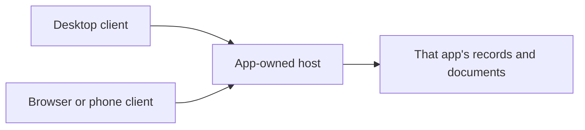

# ADR-0002: App-owned hosts with local and remote clients

- **Status:** Proposed
- **Date:** 2026-10-02
- **Scope:** Application hosting, data ownership, and access from multiple devices
- **Related:** [ADR-0001](./0001-independent-desktop-applications.md),
  [ADR-0003](./0003-managed-releases-and-safe-updates.md)

## Problem

The applications currently combine their presentation and server capabilities
in web deployments. Desktop distribution alone does not establish how a phone
or another computer accesses the same records, or what happens when a desktop
window closes.

Running a separate copy on every device would create separate data stores.
Making those copies agree introduces synchronization and conflict problems that
are substantially larger than accessing one existing installation remotely.

## What we are trying to solve

- Provide a self-contained local desktop experience.
- Allow a phone, browser, or another desktop to access the same app records.
- Keep application data under the user's control.
- Make host availability and client connection state understandable.
- Preserve a path to optional managed connectivity without requiring a cloud
  account for local operation.

## Proposed decision

Separate each application's client experience from its data-owning host. The
host owns that app's records, documents, business operations, and durability.
Clients present the app and request work from the host.

A desktop installation can provide both roles on the same computer. The host
can also operate independently of the desktop window, and another device can
act as a client of that host. Installing other Your Tools apps is unnecessary.

For a given installation, one host is authoritative. Multiple clients access
its data; they do not each maintain an independently editable replica. Separate
hosts retain separate data unless an explicit import or future synchronization
capability is provided.

Remote access requires explicit authorization and revocation. Users should know
which host they are using and whether it is reachable. Local operation should
remain useful without an external service; remote access depends on the host
being available and reachable.

Keep this boundary consistent across applications through validated shared
foundations, while preserving their separate hosts and domains. Existing
cross-app integrations remain explicit relationships between owning apps.

## Alternatives considered

| Alternative                                       | Benefit                                 | Tradeoff                                                              |
| ------------------------------------------------- | --------------------------------------- | --------------------------------------------------------------------- |
| Desktop application with no independent host role | Simple local experience                 | Couples availability to the desktop and limits remote access          |
| Mandatory centrally hosted cloud application      | Predictable availability across devices | Changes data ownership and introduces a required external service     |
| Editable local replicas on every device           | Offline use everywhere                  | Requires synchronization, conflict handling, and document replication |
| Mandatory shared host for the whole suite         | Potential operational reuse             | Makes independent apps depend on a central component                  |

App-owned hosts support local ownership and multiple clients with a smaller
consistency problem than independently editable replicas.

## Consequences

The same app can support local desktop use and access from other devices. Client
and host responsibilities can evolve separately while retaining a compatible
contract. Background operation can preserve access when a window is closed.

Separation may require substantial changes to current application composition.
It also introduces authentication, compatibility, connection handling, and
concurrent-use concerns. A sleeping or disconnected host cannot serve remote
clients; background operation does not remove that limitation.

An optional future Your Tools Connect service could simplify host discovery and
connectivity across independently installed apps. This is a possible product
and revenue boundary, not a commitment to build a service or a claim that it
would provide offline synchronization.

## Deferred decisions

- Client and server frameworks, transport, and deployment layout.
- Pairing, identity, permissions, and remote-network mechanisms.
- Background operation, startup behavior, and host availability expectations.
- Compatibility and concurrent-edit behavior.
- Native mobile applications versus a browser experience.
- Any managed connection service, pricing, or cloud provider.
- Offline editing and replication, which require a separate proposal.

## Success criteria

One app works locally without a cloud account. An authorized second device can
access the same host-owned records, and access can be revoked. Closing the
desktop window has a defined effect on host availability. Connection failures
are visible and do not imply that a second independent copy of the data exists.
