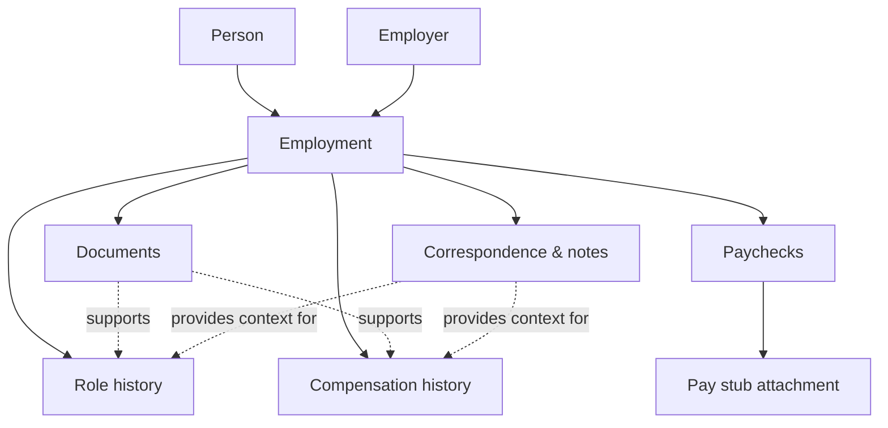

# Tenure — Domain

Tenure preserves a person's history with each employer: what they agreed to, what they were paid, and the records of important employment discussions. The employer relationship is the main way to navigate the information; this is not an HR system for managing other people.

## Domain map

**Employer** is the organization. **Employment** is a person's relationship with that organization over a period of time. Keeping them distinct allows a person to leave and later rejoin the same employer without merging separate periods of employment.

## Core concepts

| Concept | Meaning |
| --- | --- |
| Person | The individual whose employment records are being kept. Supports separate records for household members. |
| Employer | An organization a person works or has worked for. |
| Employment | A dated relationship between a person and employer, with current/former status and optional end date. |
| Role history | Positions or titles held during an employment, with effective dates. A simple current title is sufficient initially. |
| Compensation change | An agreed salary, hourly rate, or other compensation arrangement effective from a date. May include a reason and supporting document. |
| Paycheck | A particular payment and its pay period, with itemized earnings, deductions, and net pay. |
| Pay stub | The original file supporting a paycheck; its presence can be tracked independently from the entered amounts. |
| Document | A retained contract, offer, employment letter, or other official record associated with an employment. |
| Correspondence | An important exported email or discussion retained with its date, participants, and context. |
| Note | A manually written explanation or observation related to an employment or its records. |

## Paychecks and compensation are different

A **compensation change** records the agreed rate and when it took effect. It is not calculated from a pay stub. A **paycheck** records what was actually paid, including gross earnings, income tax, CPP, EI, other line items, and net pay. A bonus, overtime, partial period, or deduction can change a paycheck without changing the agreed rate.

For a paycheck, preserve the line items as they appear on the stub rather than assuming every employer uses the same categories. Amounts and the original file should remain traceable to that paycheck.

## Relationships and rules

- One person may have many employments; one employer may be linked to many people or separate periods of employment.
- Each paycheck, compensation change, document, correspondence item, and note belongs to an employment. A document may additionally support a particular change or role.
- Compensation entries have effective dates; the percentage change is derived from the previous comparable rate, not stored as an independent fact. Do not compare annual salary and hourly rate without an explicit conversion basis.
- Pay date and pay-period dates are distinct. A paycheck can be entered before its original pay stub has been saved.
- Retained email exports are records, not a synchronized mailbox. Notes add context without altering the original evidence.
- Ending an employment does not remove its records. Corrections to entered figures should not silently replace the original attached pay stub.

## Useful derived views

- **Employer overview:** current/former relationship, role, compensation, and recent records.
- **Compensation timeline:** effective rates and comparable dollar/percentage changes.
- **Pay history:** paychecks and their earnings/deductions, organized within an employment.
- **Record completeness:** paychecks missing a pay stub, or expected pay periods with no recorded paycheck when a pay schedule is known.

## Boundaries with other Your Tools apps

**Tenure owns** employment relationships, compensation history, paycheck detail, employment documents, and meaningful employment correspondence. **Taxbook consumes** relevant paycheck totals for tax tracking; it should not become a second independent owner of the same paychecks. Passbook owns financial institutions and account statements, not employment pay stubs. Other domain apps retain their own documents rather than using Tenure as a general file cabinet.

## Not modeled yet

Commission reconciliation, detailed benefits administration, professional licensing, automatic payroll-portal downloads, and email synchronization need separate design before being added. In particular, a commission arrangement is not necessarily equivalent to a fixed salary or hourly rate.
