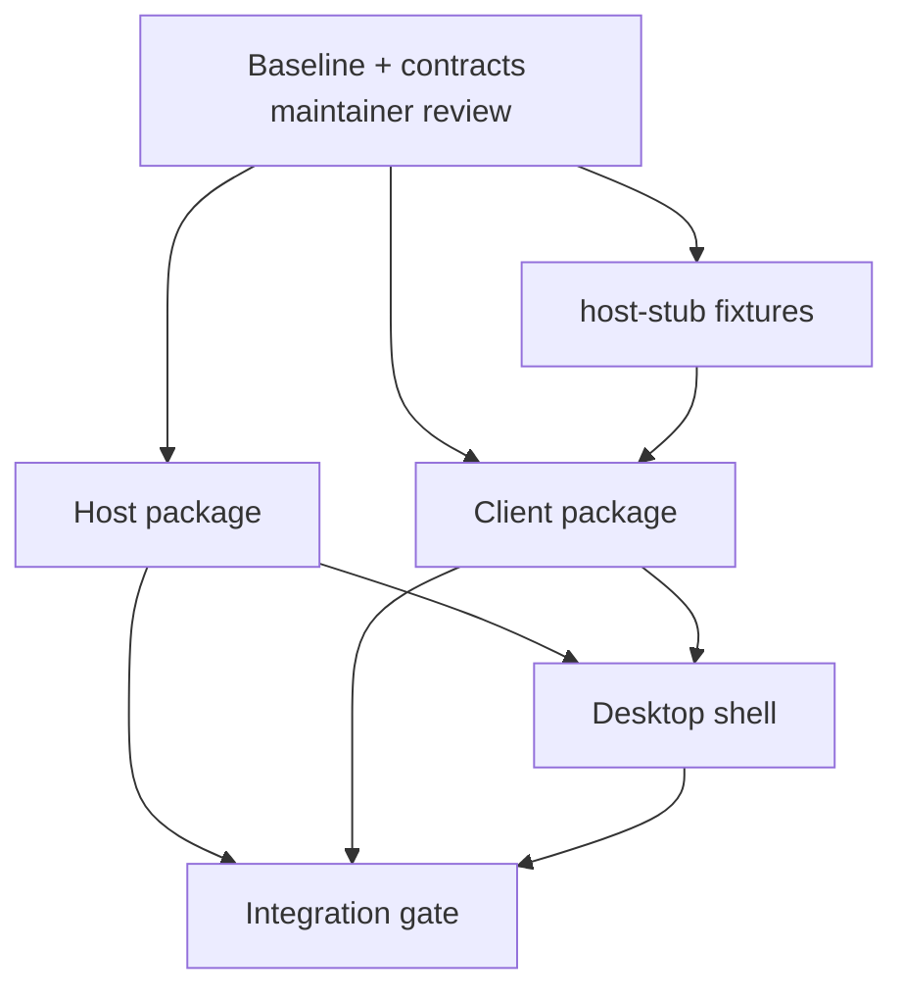

# Phase 9 — Integration and dependency plan

How the Passbook host, client, and desktop foundation assignments run together,
what proves the complete local workflow, and which work is Ready versus Blocked.

Issue: [#63](https://github.com/yourtoolshq/everyday/issues/63).

## Assignment overview

| Assignment              | Brief                                | Primary owner     | Proves                                     |
| ----------------------- | ------------------------------------ | ----------------- | ------------------------------------------ |
| Implementation baseline | [baseline.md](./baseline.md)         | Platform / #63    | Migration boundaries and technical choices |
| Host                    | [task-host.md](./task-host.md)       | Host agent        | Data-owning API without Next               |
| Client                  | [task-client.md](./task-client.md)   | Client agent      | SPA proof workflow against host            |
| Desktop                 | [task-desktop.md](./task-desktop.md) | Desktop agent     | Single-click local experience              |
| Integration gate        | This document                        | Integration owner | End-to-end workflow + persistence          |

Shared contracts: [contracts.md](./contracts.md). **One owner** updates contracts
and baseline when overlapping behavior changes — the maintainer or delegated
integration owner, not individual implementers unilaterally.

## Dependency graph



## Parallel work rules

| Workstream       | May start when                                                  | Uses                              | Must not                    |
| ---------------- | --------------------------------------------------------------- | --------------------------------- | --------------------------- |
| **host-stub**    | Baseline merged; contracts stable                               | Fictional JSON responses          | Drift from real tRPC shapes |
| **Host**         | Baseline **Ready**                                              | Real `@yourtoolshq/data`, routers | Break Next app checks       |
| **Client**       | Baseline **Ready**                                              | host-stub first                   | Change server routers       |
| **Desktop**      | Baseline **Ready**; client dev URL known; host spawn path known | Manual host OK early              | Package installers          |
| **Root tooling** | Integration owner only                                          | turbo/pnpm scripts                | Couple other apps           |

### Overlapping change ownership

| Change                                                   | Owner                                               |
| -------------------------------------------------------- | --------------------------------------------------- |
| `docs/phase-9/*` contracts and baseline                  | Integration / maintainer review                     |
| `pnpm-workspace.yaml`, root `package.json`, `turbo.json` | Integration owner                                   |
| `apps/passbook/host/**`                                  | Host assignee                                       |
| `apps/passbook/client/**`                                | Client assignee                                     |
| `apps/passbook/desktop/**`                               | Desktop assignee                                    |
| `apps/passbook/fixtures/host-stub/**`                    | Host assignee (with client review for shape parity) |
| `apps/passbook/shared/server/**` shared routers          | Host assignee with `pnpm check:passbook` gate       |
| `apps/passbook/shared/app/**` Next routes                | Untouched in foundation wave                        |

## host-stub fixture plan

Location: `apps/passbook/fixtures/host-stub/`

Purpose: let client and desktop development proceed before the real host merges.

Minimum stub surface:

| Endpoint                                                     | Stub behavior                                                        |
| ------------------------------------------------------------ | -------------------------------------------------------------------- |
| `GET /api/health`                                            | `{ "status": "ok", "state": { "state": "ready" }, "backup": { … } }` |
| `GET /api/data/status`                                       | `{ "state": "ready", "app": "passbook", … }`                         |
| tRPC `setup.state` / `setup.initialize`                      | In-memory initialized flag                                           |
| tRPC `people.list`, `institutions.create`, `accounts.create` | Fictional UUIDs                                                      |
| tRPC `overview.summary`, `overview.statementStatus`          | Reflects stub accounts/statements                                    |
| tRPC `documents.*`                                           | In-memory metadata                                                   |
| `POST /api/data/upload/document`                             | Return staging token; store bytes in memory                          |
| `GET /api/data/files/:id`                                    | Return uploaded bytes                                                |

Removal: integration gate runs with `PASSBOOK_HOST_URL` pointing at the real
host package only. Delete stub imports from client/desktop production configs;
stub may remain for client unit tests.

## Integration gate

The gate proves a **real** record/document workflow with **restart persistence**,
not merely that three packages build independently.

### Prerequisites

- [integration-plan Ready table](#ready--blocked--later) — host, client, desktop rows Ready
- Disposable data directory (never production Docker volumes)

### Procedure

```bash
# 1. Clean disposable data
rm -rf apps/passbook/.data/foundation-gate
export DATA_DIR="$PWD/apps/passbook/.data/foundation-gate"
export BACKUP_DIR="$PWD/apps/passbook/.data/foundation-gate/backups"
export PORT=3847
export PASSBOOK_HOST_URL="http://127.0.0.1:3847"

# 2. Start host (from host package handoff)
cd apps/passbook/host && pnpm start

# 3. Run integration script (add in apps/passbook/scripts/foundation-gate.mjs
#    or Playwright project passbook-foundation — owner: integration gate PR)
cd apps/passbook && pnpm foundation:gate

# 4. Restart host process; re-run read-only checks (overview + file GET)

# 5. Optional: desktop smoke
cd apps/passbook/desktop && pnpm exec playwright test e2e/desktop-smoke.spec.ts
```

### Gate assertions

| #   | Assertion                                                          |
| --- | ------------------------------------------------------------------ |
| 1   | `GET /api/health` → `status: ok` after boot                        |
| 2   | Setup creates household; second setup rejected with CONFLICT       |
| 3   | Institution + monthly account exist                                |
| 4   | Statement upload for a period succeeds; file bytes retrievable     |
| 5   | `overview.statementStatus` shows period complete                   |
| 6   | Account document upload + open works (PDF + viewer route)          |
| 7   | Kill host; restart; same `DATA_DIR`; counts and file GET unchanged |

### Map to existing checks

| Existing check                     | Role in foundation wave                             |
| ---------------------------------- | --------------------------------------------------- |
| `pnpm check:passbook`              | Regression guard for unchanged Next app             |
| `apps/passbook/e2e/*.spec.ts`      | Behavioral reference; adapt into foundation gate    |
| `pnpm migrations:check` (passbook) | Host must run same migration set                    |
| `packages/data` tests              | Platform readiness semantics unchanged              |
| Phase 7 validation Compose         | Unchanged; desktop does not replace Docker path yet |

Implementers add:

```bash
pnpm check:passbook-host
pnpm check:passbook-client
pnpm check:passbook-desktop
pnpm foundation:gate   # apps/passbook package script
```

## Fictional / disposable data setup

- Use names like "Test household", "Northwind Bank", "Everyday Chequing"
- PDF fixtures: minimal `%PDF-1.4` buffer (see `e2e/uploads.spec.ts`)
- Never mount `passbook-data`, `passbook-backups`, or developer production `.data`
- Desktop and gate tests use dedicated subdirs under `apps/passbook/.data/`

## Later phases building on this gate

| Capability                                  | Builds on                                 | Phase / ADR                     |
| ------------------------------------------- | ----------------------------------------- | ------------------------------- |
| Managed host updates with backup checkpoint | Running host + `@yourtoolshq/data`        | Phase 8, ADR-0003               |
| Packaged macOS arm64 desktop installer      | Host-served SPA + self-contained host     | Current local-package milestone |
| Authenticated phone/browser client          | Host loopback contract extended with auth | ADR-0002 Later                  |
| Second app validation                       | Passbook host/client pattern              | ADR-0001 shared foundations     |
| Generic shared runtime package              | Two app proofs                            | Shared-candidate convention     |
| Next.js production cutover                  | Integration gate green                    | Separate cutover plan           |

## Ready / Blocked / Later

Maintainer: update **Decision** column after review. Implementation agents must
not start rows marked Blocked.

| Item                                                           | Decision                              | Depends on                                  | Unblocks                               |
| -------------------------------------------------------------- | ------------------------------------- | ------------------------------------------- | -------------------------------------- |
| Phase 9 baseline docs (#63)                                    | **Ready** (pending maintainer review) | ADRs on branch                              | Maintainer review                      |
| Maintainer review of baseline                                  | **Blocked**                           | #63 merge                                   | Host/client/desktop assignments        |
| Initial desktop OS/architecture                                | **Ready**                             | macOS Apple Silicon (`arm64`) confirmed     | Desktop packaging, OS data paths       |
| Host foundation assignment                                     | **Blocked**                           | Maintainer review                           | Real host integration, desktop spawn   |
| Client foundation assignment                                   | **Blocked**                           | Maintainer review                           | Desktop UI load, integration gate UI   |
| Desktop foundation assignment                                  | **Blocked**                           | Maintainer review + OS target               | Desktop integration gate smoke         |
| host-stub fixtures                                             | **Blocked**                           | Maintainer review                           | Parallel client/desktop against stub   |
| Root workspace scripts (`check:passbook-*`, `foundation:gate`) | **Blocked**                           | Integration owner after first package lands | CI for foundation wave                 |
| Integration gate script                                        | **Blocked**                           | Host + client Ready                         | Declaring foundation wave complete     |
| Unsigned macOS arm64 local package                             | **Ready**                             | Host-served SPA + self-contained host       | Local installed-app testing            |
| Installed macOS arm64 acceptance gate                          | **Later**                             | Real Apple Silicon package                  | Declaring local desktop workflow ready |
| Desktop document-opening policy and validation                 | **Later**                             | Installed-app acceptance gate               | Full document workflow                 |
| Signed/notarized nightly macOS release                         | **Later**                             | Apple credentials + local package proof     | Normal installation                    |
| Linux, Windows, Intel macOS, and Mac App Store                 | **Out of scope**                      | None                                        | None                                   |
| Remote authenticated access                                    | **Later**                             | Local foundation proven                     | Phone/remote clients                   |
| Next production cutover                                        | **Later**                             | Foundation gate + maintainer cutover plan   | Retire combined Next deployment        |
| Shared runtime extraction                                      | **Later**                             | Second app validation                       | `@yourtoolshq/runtime` candidate       |
| Nightly desktop updater                                        | **Later**                             | Signed GitHub prereleases + recovery gate   | ADR-0003                               |
| Installed-product versus development isolation                 | **Later**                             | App identity, data, port, and backup policy | Safe local development                 |

## Concurrent execution summary

**Wave 1 (after maintainer marks baseline Ready):**

1. Integration owner adds workspace entries and stub directory scaffold.
2. Host and client assignees work in parallel (client on stub).
3. Desktop assignee starts once host spawn command and client dev URL exist.

**Wave 2:**

1. Client switches from stub to real host.
2. Integration owner lands `foundation:gate` and desktop smoke.
3. Maintainer reviews gate evidence before marking foundation wave complete.

## Handoff to next wave (#63 completion)

When #63 closes, provide:

1. Links to all `docs/phase-9/*` deliverables
2. Recommended choices table from [baseline.md](./baseline.md)
3. Unresolved decisions list (OS target, HTTP library, cutover timing)
4. `pnpm check` result for docs PR
5. Updated Ready/Blocked/Later table with maintainer decisions
6. Exact brief paths ready for agent assignment — **do not** create GitHub issues
   for host/client/desktop until maintainer approves breakdown

## Verification for this documentation issue

```bash
pnpm check
```

Confirm links from [docs/adr/README.md](../adr/README.md) and
[ROADMAP.md](../../ROADMAP.md) resolve to this package.
